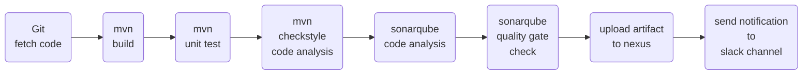

# Jenkinsfile
What is a ***Jenkinsfile ?***  
- Automate pipeline setup with Jenkinsfile
- Jenkinsfile defines stages in CI/CD pipeline
- Jenkinsfile is a text file with pipeline DSL syntax
- Similar to groovy
  - Scripted
  - Declarative

### Jenkinsfile flow :

### Steps :
#### <ins> *Note* </ins>  : Keep updating the Jenkinsfile in the pipeline job while doing the following steps stage-by-stage.
- Create three servers for: ([Click here for installation and provisioning of the servers](https://github.com/yogeshgunasekaran/Automated-Provisioning-Project-2))
    - **Jenkins**
    - **SonarQube**
    - **Nexus**
    
- In Jenkins server - **Manage Plugins:**
  - add **SonarQube Scanner** plugin
  - add **Nexus Artifact Uploader** plugin
  - add **Pipeline Maven Integration** plugin
  - add **Pipeline Utility Steps** plugin
  - add **Build Timestamp** plugin
  - add **Slack Notification** plugin
  
- In Jenkins - **Manage Credentials:**
  - Add credentials as **username and password**
  - Give the nexus server username and password and ID & Description as **nexus-login**
  
- In Jenkins - **Global Tool Configuration:**
  - Add **SonarQube Scanner**
    - configure sonarqube scanner with name as **sonar4.7**
    
- In Jenkins - **Configure System:**  
  - configure sonarqube server details and integrate it with jenkins,
    - checkbox the **Environmental variables**
    - add name as **sonar**
    - add server url **http ://sonarqube-private-ip:9000**
    - Go to **sonarqube server &rarr; Administrator &rarr; My Account &rarr; Security &rarr; Generate tokens**. Login with default **username: admin** and **password: admin**
    - Add credentials as **secret text** with sonarqube token and ID & Description as **MySonarToken**
  - configure Build Timestamp
    - checkmark **Enable Build Timestamp**
    - choose the required **timezone** and its **pattern** 
  - configure the Slack details and integrate it with jenkins as,
    -  Add Slack **Workspace** name
    -  Go to Slack, Add **Jenkins CI** app and select the channel to receive the notifications. Copy the token and save the settings.
    -  Add credentials as **secret text** with **slack token** and ID & Description as **SlackToken**
    -  Add default **channel name** of slack to receive the notifications
    -  Test Connection
    
- In Jenkins, **New item &rarr; Pipeline**. Run the **Jenkinsfile_stage1** here and build the job    
- In Jenkins, Get the generated paths from project **Workspace** and update the same job with **Jenkinsfile_stage2** code and Build the job again 
- Now our project has been mvn build, mvn tested, mvn code analyzed, and default sonarqube code analyzed. In **SonarQube**, we can see our project code analzyed reports  
- In sonarqube, create **Quality Gate** with required **conditions**  
- In sonarqube, click our **project &rarr; project settings &rarr; select the Quality Gate** that has been created
- In sonarqube click our **project &rarr; project settings &rarr; Webhooks &rarr; Create**
    - Give a name **jenkins-ci-webhook**
    - URL **http ://jenkins-private-ip-here:8080/sonarqube-webhook**
- In Jenkins, now update the same job with **Jenkinsfile_stage3** code and Build the job again 
- Now our project has been build, mvn tested, mvn code analyzed, sonarqube code analyzed, sonarqube quality gate checked. In **SonarQube**, we can see our project code analzyed reports. Next will update the build artifact to the nexus repository   
- In Nexus, Login as **admin** with password that has been saved in 'jenkins manage credentials' and **Create repository &rarr; maven2(hosted)** with name **vprofile-repo**
- In Jenkins, now update the same job with **Jenkinsfile_stage4** code and Build the job again 
- In Nexus, the artifact would have been uploaded after the above job was success
- In Jenkins, now update the same job with **Jenkinsfile_stage5** code with the slack channel details and Build the job again. This will send **slack notifications** to the **slack channel**. Note, the slack should have been provisioned with jenkins app and API to receive these notifications

