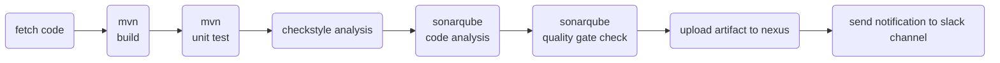

# Jenkinsfile
This repository contains sample Jenkinsfile - a declarative script for pipeline as a code    
What is a ***Jenkinsfile ?***
- Automate pipeline setup with Jenkinsfile
- Jenkinsfile defines stages in CI/CD pipeline
- Jenkinsfile is a text file with pipeline DSL syntax
- Similar to groovy
  - Scripted
  - Declarative

## 1. Jenkinsfile_1
Flow:

### Prerequisite
http://github.com - automatic!
[GitHub](http://github.com)
- 2 servers:
    - jenkins
    - sonarqube
- in jenkins **Manage Plugins:**
  - add sonarqube scanner
- in jenkins **Global Tool Configuration:**
  - configure sonarqube scanner with a 'name'
- in jenkins **Configure System:**
  - configure the sonarqube server details with,
    - name
    - server url
    - sonarqube server authentication 'token'
