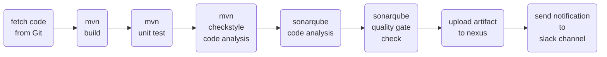

# Jenkinsfile
This repository contains sample Jenkinsfile - a declarative script for pipeline as a code    
What is a ***Jenkinsfile ?***
- Automate pipeline setup with Jenkinsfile
- Jenkinsfile defines stages in CI/CD pipeline
- Jenkinsfile is a text file with pipeline DSL syntax
- Similar to groovy
  - Scripted
  - Declarative

## 1. Jenkinsfile_1
### Flow :

### Steps :
- Create two servers for: ([Click here for installation and provisioning of the servers](https://github.com/yogeshgunasekaran/Automated-Provisioning-Project-2))
    - **Jenkins**
    - **SonarQube**
- In Jenkins server - **Manage Plugins:**
  - add sonarqube scanner plugin
- In Jenkins server - **Global Tool Configuration:**
  - configure sonarqube scanner with name as 'sonar4.7'
- In Jenkins server - **Configure System:**  
  configure the sonarqube server details and integrate it with jenkins as,
    - name 'sonar'
    - server url 'http ://sonarqube-ip:9000'
    - generate an authentication 'token' from sonarqube
    - Add credentials as secret text with sonarqube token and ID 'MySonarToken'
- In sonarqube server create 'Quality Gate' with required conditions   
- In sonarqube server click our project-->project settings-->select the Quality Gate
- In sonarqube server click our project-->project settings-->Webhooks-->Create
    - Give a name 'jenkins-ci-webhook'
    - URL 'http ://jenkins-ip-here:8080/sonarqube-webhook'
- In Jenkins create a new job as 'Pipeline' and paste the Jenkinsfile script in the script section with updated details

